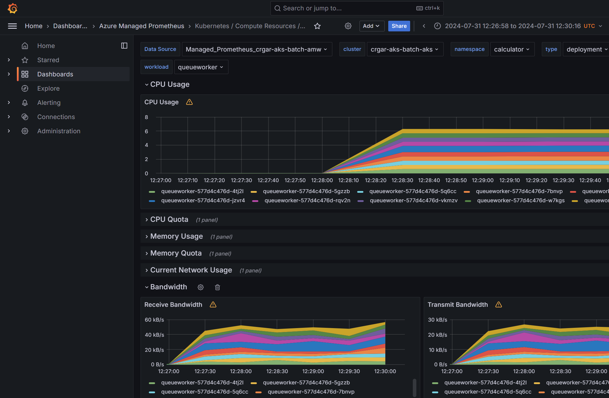

# [In progress] Running Batch workloads on PaaS services

This repo shows how you can run HPC works on PaaS services.
The first one is AKS or Kubernetes


## Repo structure:
```
-infra: Infrastructure as code for the Azure services required
-deployment: The Kustomize and K8s manifests for the deployment of the client and the worker applications
-src: The source code for the client and worker applications
```


## Architecture
The repo focuses on the inner of a spoke in an enterprise-scale hub spoke.
To make things simpler, we do not add networking and security components as they would slow down the initial deployment

The repo has a client application, that is a website that send jobs to a queue.
The calculator worker takes the message and send it back to another session-enabled queue.
Sessions are used to point the response to the right client.


## Monitoring
Grafana is the main visualizer for workload metrics:



## Some useful monitoring queries
```
ContainerLogV2
| where TimeGenerated > ago(15m)
| where LogMessage contains "Finish processing message"
| extend ProcessingTime = toint(split(split(LogMessage, "[")[5],"]")[0])
| summarize processingcount = count() by bin(TimeGenerated, 1m), PodName
| project TimeGenerated, PodName, processingcount 
| render timechart 
```
```
ContainerLogV2
| where TimeGenerated > ago(15m)
| where LogMessage contains "Finish processing message"
| extend ProcessingTime = toint(split(split(LogMessage, "[")[5],"]")[0])
| project TimeGenerated, PodName, ProcessingTime
| render timechart 
```
